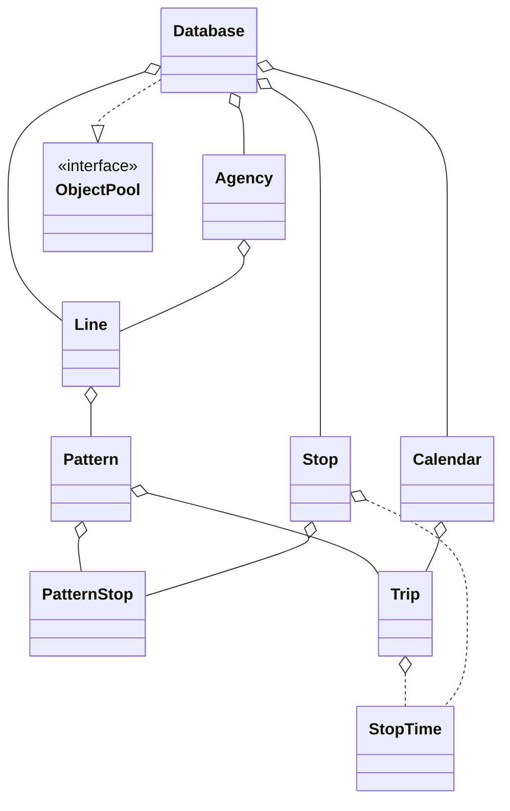

Zespół 4
========

Skład: Mateusz Brzozowski, Konrad Wojda, Mikołaj Kuranowski

Wymagania i założenia projektu
==============================

Projekt ma na celu ułatwienie przedsiębiorstwu komunikacyjnemu układanie rozkładu jazdy.

Założenia funkcjonalne
----------------------

- [x] Wprowadzanie podstawowych informacji o przedsiębiorstwie komunikacyjnym
- [x] Tworzenie przystanków
- [x] Tworzenie różnych dni kursowania
- [x] Tworzenie linii
- [x] Tworzenie tras (w ramach linii)
- [x] Tworzenie kursów (w ramach linii i dni kursowania)
- [x] Wyświetlanie siatek rozkładów (w ramach linii i dni kursowania)
- [x] Generowanie tabliczek przystankowych
- [x] Eksport do pliku GTFS

Założenia techniczne
--------------------

- [x] Aplikacja desktopowa
- [x] Napisana w języku Java z wykorzystaniem środowiska Maven
- [x] Interfejs graficzny z wykorzystaniem biblioteki Swing lub JavaFX
- [x] Dane przechowywane w centralnej bazie danych

Podział prac
------------

Każda osoba odpowiedzialna jest za jedną część aplikacji, zgodnie z wzorcem MVC:

- Model: Mikołaj Kuranowski
- Widoki: Mateusz Brzozowski
- Kontrolery: Konrad Wojda

Wymagane konstrukcje
--------------------

- [x] [wykorzystanie pętli for-each](src/main/java/edu/iipw/pap/db/model/Pattern.java#L270)
- [x] wykorzystanie jednego z następujących elementów:
    - [x] [typ wyliczeniowy](src/main/java/edu/iipw/pap/db/model/WheelchairAccessibility.java)
    - [ ] własny typ generyczny
    - [x] [zmienna liczba parametrów metody](src/main/java/edu/iipw/pap/db/Database.java#L127)
    - [ ] własna adnotacja
    - [x] [wyrażenie lambda](src/main/java/edu/iipw/pap/controller/ViewStopTimetableController.java#L71)
- [x] wykorzystanie strumieniowego przetwarzania danych w kolekcjach
    ([część 1](src/main/java/edu/iipw/pap/db/model/Stop.java#L289))
    ([część 2](src/main/java/edu/iipw/pap/controller/ViewStopTimetableController.java#L71))
- [x] zdefiniowanie testów jednostkowych dla metod publicznych w modelu (zakładając, że stosujemy MVC):
    - [x] [sytuacje poprawne](src/test/java/edu/iipw/pap/TestsPattern.java#L54)
    - [x] [sytuacje niepoprawne](src/test/java/edu/iipw/pap/TestsPattern.java#L78)
    - [x] [sytuacje graniczne](src/test/java/edu/iipw/pap/TestsPattern.java#L80)
- [x] definiowanie i rzucenie własnego wyjątku w modelu i jego obsługa w kontrolerze
    - [x] [definiowanie wyjątku](src/main/java/edu/iipw/pap/exceptions/InvalidData.java)
    - [x] [rzucenie go w modelu](src/main/java/edu/iipw/pap/db/model/Agency.java#L227)
    - [x] [obsługa w kontrolerze](src/main/java/edu/iipw/pap/controller/EditAgencyController.java)

Podział modułów
===============

- `edu.iipw.pap.db.model` - model
- `edu.iipw.pap.db` - połączenie z bazą danych
- `edu.iipw.pap.controller` - kontrolery
- `edu.iipw.pap.exceptions` - własne wyjątki
- `edu.iipw.pap` - punkt wejściowy do aplikacji oraz pozostałe pomocnicze klasy

Widoki zdefiniowane są w plikach fxml w katalogu `resources.view`

Diagram klas w modelu:

