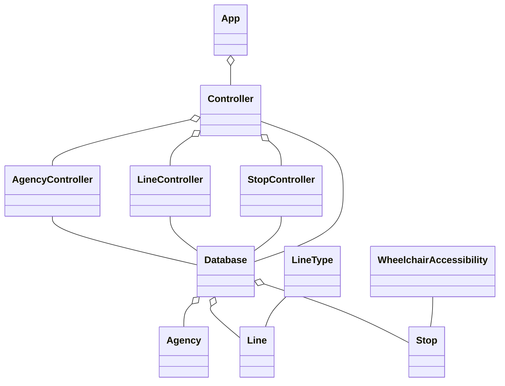

# Podział modułów

- `edu.iipw.pap.db.model` - model zgodnie z wzorcem MVC
- `edu.iipw.pap.db` - połączenie z bazą danych
- `edu.iipw.pap.controller` - kontrolery zgodnie z wzorcem MVC
- `edu.iipw.pap` - punkt wejściowy do aplikacji

Widoki zdefiniowane są w plikach fxml w katalogu `resources.view`

