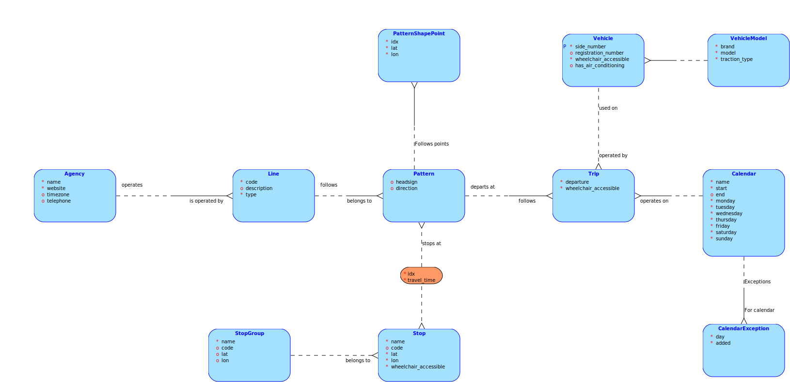
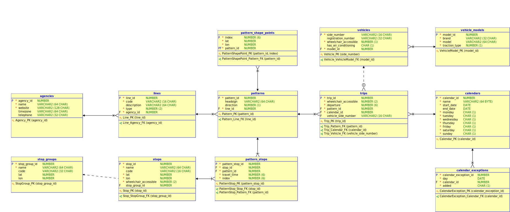
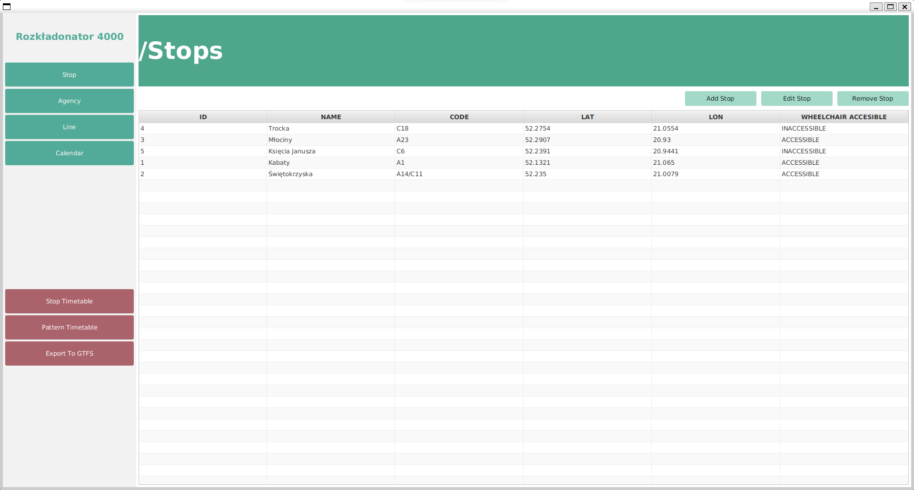
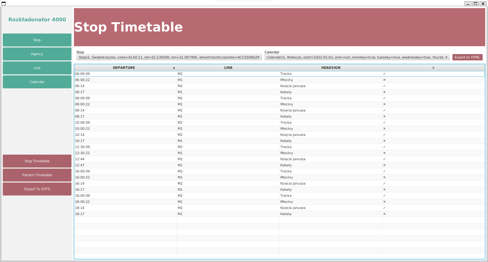

# ROZKŁADONATOR 4000

### Przedmiot
- Bazy Danych 1
- Programowanie Aplikacyjne

### Członkowie zespołu:
- Brzozowski Mateusz
- Kuranowski Mikołaj
- Wojda Konrad

### Opiekunowie:
- Radlak Krystian
- Szmurło Agnieszka

## Krótki opis rozwiązania

Projekt ma na celu ułatwienie przedsiębiorstwu komunikacyjnemu układanie rozkładu jazdy.
Z tego powodu, rozwiązanie jest w pełni zgodne ze standardem GTFS (General Transit Feed Specification),
służącym do zapisu informacji o rozkładach jazdy i lokalizacji przystanków.

W ramach aplikacji użytkownik wprowadza wymagane dane dotyczące przystanków, lini, kalendarzy
i przedsiębiorstw komunikacyjnych. Następnie na podstawie wprowadzonych informacji program generuje
tabliczki przystankowe i tzw. „kursówki”, które następnie użytkownik może wyświetlić w programie.
Dodatkowo wprowadzone dane mogą zostać wyeksportowane do pliku GTFS.

## Model ER

## Model Relacyjny

## Screens

Widok główny programu:

Przykład wstawiania danych:

Przykłąd wyniku programu:

## Analiza rozwiązania

W naszym programie występują następujące ograniczenia:
- Brak możliwości dodania do rozkłądu lini okrężnych
- Utworzenie kursów, które będą odbywały się po wielu liniach

Roziązanie można oczywiście rozwijać w następujący sposób:
- Dodanie większej ilości rozwiązań dostępnych w standardzie GTFS
- Dodanie możliwości edytowania pozostałych tabel z poziomu GUI
- Dodanie kolejnych wyników na podstawie podanych przez użytkownika danych
- Zwiększenie ilości sposobów na wyświetlania wyników
- Dodanie więcej możliwości na eksportowanie danych do pliku
- Dodanie możliwości importowania danych z pliku
- Dodanie mapy, na której wyświetlały by się trasy
- Dodanie CSS, tak aby aplikacja wyglądała w bardziej przystępny sposób

Wymagane pliki:
- skrypty do założenia schematu bazy danych: [Test Database](./database/test_database.sql)
- skrypty do załadowania danych:
- skrypty testujące bazę danych: [Insert Data](./database/insert_data.sql)
- definicje sekwencji, wyzwalaczy, procedur, funkcji: [Create Procedures](./database/create_procedures.sql)