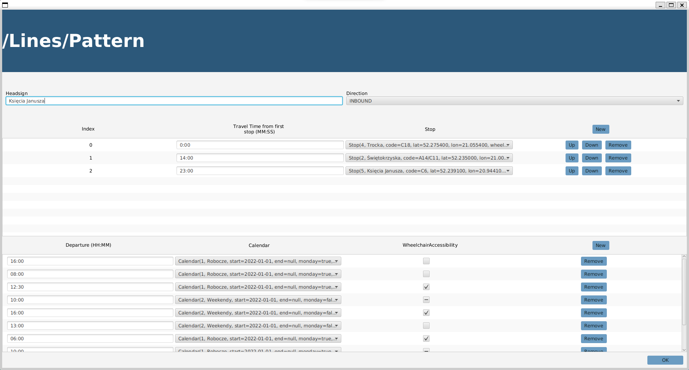

# ROZKŁADONATOR 4000

### Przedmiot
- Bazy Danych 1
- Programowanie Aplikacyjne

### Członkowie zespołu:
- Brzozowski Mateusz
- Kuranowski Mikołaj
- Wojda Konrad

### Opiekunowie:
- Radlak Krystian
- Szmurło Agnieszka

## Krótki opis rozwiązania

Projekt ma na celu ułatwienie przedsiębiorstwu komunikacyjnemu układanie rozkładu jazdy.
Z tego powodu, rozwiązanie jest w pełni zgodne ze standardem GTFS (General Transit Feed Specification),
służącym do zapisu informacji o rozkładach jazdy i lokalizacji przystanków.

W ramach aplikacji użytkownik wprowadza wymagane dane dotyczące przystanków, lini, kalendarzy
i przedsiębiorstw komunikacyjnych. Następnie na podstawie wprowadzonych informacji program generuje
tabliczki przystankowe i tzw. „kursówki”, które następnie użytkownik może wyświetlić w programie.
Dodatkowo wprowadzone dane mogą zostać wyeksportowane do pliku GTFS.

## Model ER

## Model Relacyjny

## Screens

Widok główny programu:

Przykład wstawiania danych:

Przykłąd wyniku programu:

## Analiza rozwiązania

W naszym programie występują następujące ograniczenia:
- Brak możliwości dodania do rozkładu linii okrężnych
- Utworzenie kursów, które będą odbywały się po wielu liniach

Rozwiązanie można oczywiście rozwijać w następujący sposób:
- Dodanie większej ilości rozwiązań dostępnych w standardzie GTFS
- Dodanie możliwości edytowania pozostałych tabel z poziomu GUI
- Dodanie kolejnych wyników na podstawie podanych przez użytkownika danych
- Zwiększenie ilości sposobów na wyświetlania wyników
- Dodanie więcej możliwości na eksportowanie danych do pliku
- Dodanie możliwości importowania danych z pliku
- Dodanie mapy, na której wyświetlały by się trasy
- Dodanie CSS, tak aby aplikacja wyglądała w bardziej przystępny sposób

W trakcie pisnia aplikacji wykorzystaliśmy technologię JPA wraz z frameworkiem Hibernate. Niestety, aby poprawnie zintegrować zmapowane obiekty z JavaFXem - atrybuty obiektów modelu musiały spełniać interfejs [Observable](https://openjfx.io/javadoc/17/javafx.base/javafx/beans/Observable.html) - co stworzyło sporo problemów po stronie mapowania O/R i wymusiło wykorzystanie pliku .hbm do definicji tego mapowania, zamiast preferowanych adnotacji.

Warto także wspomnieć, iż nasz projekt od początku pisania aplikacji nie był przemyślany pod kątem UX, dlatego też nasza aplikacja skupiona jest bardziej na spełnianiu wymagań przedmiotowych, niż spełnianiu wrażeń użytkownika, jakie napotka w trakcie korzystania z aplikacji. Jednakże realizacja UX, nie była przedmiotem projektu.

Wymagane pliki:
- skrypty do założenia schematu bazy danych: [Create Schema](./database/create_schema.ddl)
- skrypty do załadowania danych: [Insert Data](./database/insert_data.sql)
- skrypty testujące bazę danych: [Test Database](./database/test_database.sql)
- definicje sekwencji, wyzwalaczy, procedur, funkcji: [Create Procedures](./database/create_procedures.sql)
